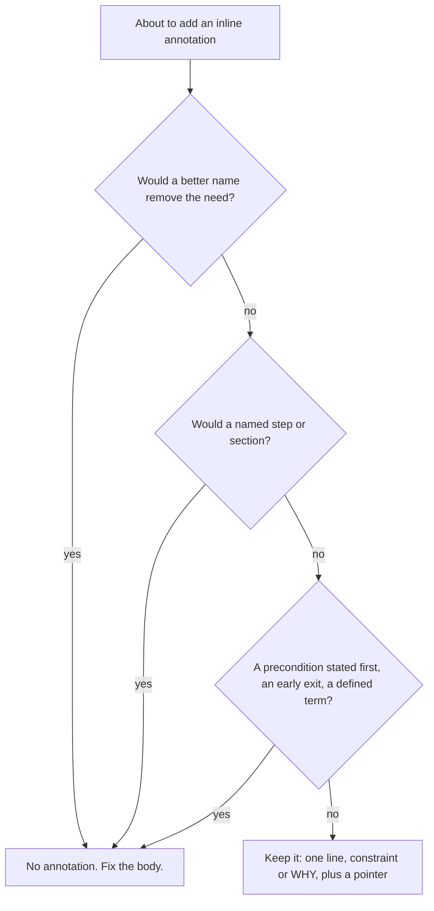

# Comments and Annotations Rules

How a work product carries its own meaning, and how short an annotation must be
when one is genuinely needed. Project-agnostic and domain-agnostic: it applies
to source code, documents, spreadsheets, prompts and agent instructions,
configuration, runbooks and slides alike. "Annotation" means any inline note
that is not the work itself: a code comment, a bracketed or margin note in a
document, a cell note in a spreadsheet, a comment line in a prompt or config
file, a speaker note, a struck-through-but-kept passage.

It answers two questions: *should this annotation exist at all, and how short
must it be?* (density, brevity, structure) and *where does the rationale live,
and can the audience read this surface?* (destination, visibility).

## The Rule

**Front matter stays. Narration goes. What survives gets short.**

1. **Front matter is untouched by this rule.** Whatever your domain uses to
   describe a unit's purpose and interface stays mandatory: doc comments on
   public code (Javadoc, TSDoc, docstrings), the purpose paragraph of a
   document, the data dictionary of a dataset, the description block of a
   prompt, skill or agent, the owner-and-scope header of a runbook. This rule
   governs annotations *inside the body*.

2. **The primary lever is structure, not annotation.** An inline annotation
   usually signals that the body is not clear enough, and the first move is
   always to fix the body: intention-revealing names (identifiers, headings,
   column headers, step titles, tab names), preconditions stated up front
   (guard clauses, early exits, "stop here if"), and composition into named
   steps. A unit reads top-down as a sequence of named steps, each doing the
   one thing its name states. A reader follows the process by reading the work
   itself, not a commentary track beside it.

3. **Annotations are not forbidden.** Where the body genuinely cannot carry the
   meaning (a non-obvious constraint, an invariant, a workaround for something
   external, an obligation imposed from outside) an annotation is the right
   tool. This rule governs its *cost*, not its existence. **Deleting
   annotations is never the goal**; a body that carries its own meaning is.

## The brevity standard

What survives the structural fix must be readable at a glance. An annotation
that slows down a reader skimming the unit has failed even when its content is
correct.

- **One line is the target. Three lines is the hard ceiling.**
- **A fragment, not prose.** No multi-paragraph narration, no build-up, no
  "Note that...".
- **It states the constraint or the WHY**, never what the next line, cell or
  paragraph does.
- **Where a durable home exists, the annotation is a pointer, not a summary of
  it.** The decision record, knowledge-base entry, or rule file carries the
  reasoning; the annotation carries the breadcrumb.

**Reading-speed litmus:** *a reader skimming the unit absorbs the annotation in
about a second and keeps moving.* If it needs re-reading, it is too long, or it
belongs in a decision record.

## Worked examples

### A. Source code: narration dissolves into named steps

Before: every comment restates the line beneath it, and one wall of lines needs
a comment precisely because it is a wall.

```java
public ExportResult execute(final UUID reportId, final String format) {
    // Find report
    final Report report = reportRepository.findById(reportId)
        .orElseThrow(() -> new ReportNotFoundException(reportId));
    // Verify status allows export
    if (!report.getStatus().canExport()) {
        throw new IllegalStateException("Cannot export report in status: " + report.getStatus());
    }
    // Step 1: Render the report
    final RenderedReport rendered = renderer.render(report, format);
    // Step 2: Store the rendered file (using content type from renderer)
    final String extension = rendered.extension() != null ? rendered.extension() : DEFAULT_EXTENSION;
    final String contentType = rendered.contentType() != null ? rendered.contentType() : DEFAULT_CONTENT_TYPE;
    final String storagePath = storage.store(reportId + "-export" + extension, contentType, rendered.bytes());
    // Step 3: Update domain model
    report.markExported(storagePath);
    // Step 4: Save
    return new ExportResult(reportRepository.save(report).getUuid(), storagePath);
}
```

After: the steps did not disappear; they became addressable.

```java
public ExportResult execute(final UUID reportId, final String format) {
    final Report report = loadExportableReport(reportId);
    final RenderedReport rendered = renderer.render(report, format);
    final String storagePath = storeRenderedFile(reportId, rendered);

    report.markExported(storagePath);
    return new ExportResult(reportRepository.save(report).getUuid(), storagePath);
}
```

`// Step 4: Save` above a save call is the shape to recognise: the comment
count grew with the step count, and not one line told the reader anything the
code did not already say.

The comment that survives keeps its place, compressed to a pointer:

```java
// WRONG: correct content, four lines of it, in the middle of the body
// This query has to be raw SQL. The reason is that our entities carry a class-level
// soft-delete filter, which means the ORM query language silently skips soft-deleted
// rows. Since this result feeds a unique constraint, skipping them produces
// duplicate key violations at insert time.

// RIGHT: same constraint, one line, reasoning lives in its durable home
// Must be a native query: the ORM soft-delete filter skips rows, see <KB-ENTRY-ID>
```

### B. A prompt file: the same shape outside code

Before:

```text
# ---- SYSTEM PROMPT ----
# This section tells the model who it is
You are a support assistant for <product>.
# This section lists the rules the model must follow
Rules: answer in the customer's language; never promise refunds.
# We keep the JSON example below because in testing the model kept answering in prose
# when the example was removed. We tried describing the format in words twice and it
# did not help, so please leave the example in even though it looks redundant.
Respond as JSON: {"answer": "...", "escalate": true|false}
```

After:

```text
ROLE
You are a support assistant for <product>.

RULES
- Answer in the customer's language.
- Never promise refunds.

OUTPUT FORMAT
# Keep the example: without it the model drifts to prose, see <EVAL-RECORD-ID>
Respond as JSON: {"answer": "...", "escalate": true|false}
```

Headings replaced the narration. The one annotation that survives states a
constraint the text cannot show and points to the evidence. `#` is this prompt
format's comment syntax and the loader strips those lines; in a format with no
comment syntax, the pointer goes into the description block that rule 1 keeps,
not into the body the model reads.

### The same moves in other domains

| Domain | Rename | Extract | Restructure | Narration to dissolve |
|---|---|---|---|---|
| Documents | a heading that says what the section is | named sub-sections | state the assumption or precondition first | "In this section we will..." |
| Spreadsheets | header row, named ranges | a helper column with a header | input / calculation / output tabs | cell note "sums the column above" |
| Config and infrastructure | key and variable names that carry units and intent | one block per concern | fail fast on a missing value | `# set the port` above `port:` |
| Runbooks and processes | step titles that name the outcome | a named sub-procedure | "Stop if..." checks before the steps | "Step 4: run the command" |
| Slides and design | the slide title states the claim | one idea per slide, detail to an appendix | agenda as the structure | speaker notes restating the slide |
| Prompts, skills and agent instructions | a heading per concern (role, rules, output format); a description block that states the trigger | one instruction per section; reference material into a file loaded on demand | stop conditions and blocking questions before the steps | `# this section tells the model who it is` |
| Agent-workspace files: constitutions, rule files, knowledge-base entries, decision records | a symptom-style title; a rule file named for its domain | one file per domain or entry; a constitution row that points to the rule file | the imperative first, then the WRONG/CORRECT pair, then the gotchas; the required fields in their fixed order | a `> Note:` restating the heading; a preamble announcing what the file is about to say |
| Scripts, hooks and CI workflows | a function or step name that says what the step achieves; variables that carry units | one function per concern; a named job or step | fail fast on a missing input or tool, before any side effect | `# loop over the files` above a loop |
| Tests | a test name that states the behaviour under test | a named fixture or builder for the setup | the precondition as a guard or the first assertion | `// call the method`, `// check the result` (the phase markers themselves are protected, see below) |

## Litmus ladder: apply before adding any inline annotation

1. **Rename.** Does an intention-revealing name, heading, header or step title
   make it redundant?
2. **Extract.** Would a named step, section, helper or sub-procedure turn the
   annotated block into a self-describing unit?
3. **Restructure.** Would a precondition stated first, an early exit, a defined
   term or a value object remove the confusion?
4. **Compress.** If the annotation still earns its place, cut it to one line
   plus a pointer before committing.

Steps 1 to 3 are the rule. Step 4 is what keeps the survivors cheap.



## Anti-patterns

```java
// WRONG: step narration; the count grows with the unit and says nothing new
// Step 5: Save
repository.save(order);

// WRONG: restates the line beneath it
// Loop through all orders
for (final Order order : orders) { ... }

// WRONG: section-divider banner; if a unit needs sections, it needs named steps
// ============ VALIDATION ============

// WRONG: multi-paragraph rationale in the body (belongs in a decision record)
// We chose the split-table approach here because a single table with a nullable
// owner_id would have meant ... [continues for 9 lines]

// WRONG: kept-but-disabled content; version history is the archive
// final var legacy = oldService.compute(x);
```

The non-code equivalents: "In this paragraph we explain...", a "Notes:" block
at the end of a document that repeats the body, struck-through text kept "for
reference", hidden rows, columns or slides kept "just in case", `[TODO fill in]`
left in a published document, author-to-author chatter in cell notes or speaker
notes.

In **audience-visible artifacts** (web templates, stylesheets and translation
bundles, published documents, exported spreadsheets and slide decks whose notes
travel with the file, email templates, shared prompts, changelogs, anything
that reaches a user's browser or a release artifact) three more shapes are
forbidden outright, because the audience can read them:

- **Decision-history narrative.** "We considered X but chose Y because Z."
- **Competitor or peer-product references.** "Matches the <vendor> pattern."
  Name the *behaviour*, never the company that also uses it.
- **Ticket narratives and auditor-bait reassurances.** "Per <TICKET-ID>
  feedback", "no personal data is logged here", "this satisfies § N of
  <regulation>". Compliance is proven by controls and evidence, not by inline
  claims a reader cannot verify.

A bare ticket reference on a changelog bullet (`… (<TICKET-ID>)`) is the
versioning-and-changelog rule's convention and is not an annotation; what this
rule forbids is the story around it.

## Audience litmus: where rationale lives

Run this pass after the ladder above. Read the annotation as if you saw it for
the first time as a member of the audience: View Source on a customer's
browser, the cell note in a forwarded spreadsheet, the speaker notes in a
shared deck. A "yes" to any question means the annotation belongs in one of the
homes below, with at most a one-line pointer left in the artifact:

1. Could a customer, partner or journalist quote this line back at us out of
   context?
2. Does this name a competitor, peer product, or industry segment?
3. Does this narrate a decision the reader cannot verify from the surrounding
   work?
4. Does this exceed three lines?
5. Does this reference a ticket or change request by id?

| Rationale type | Home |
|---|---|
| Architectural or design decision, cross-cutting choice | Decision record (`<DECISION-RECORD-ID>`) |
| Feature, content or UX rationale | Feature or design documentation |
| Cross-cutting pattern future work must follow | A rule file in this workspace |
| Per-change review-feedback context | The change or pull-request description |
| Investigation, root cause, lessons learned | Knowledge base (`<KB-ENTRY-ID>`) |
| Audience-facing release note | One terse changelog bullet: what changed and what the operator will observe, not the design history |

Commit and change messages are the relaxed case: decision context there is fine
and helps future archaeology. Prefer the same "behaviour, not company" framing
anyway.

```text
// WRONG — decision narrative at the call site
// We evaluated three retry libraries and chose X because Y's maintainer ...
// (12 more lines)

// CORRECT — constraint + pointer
// Retries must be idempotent — see <DECISION-RECORD-ID>
```

## Sanctioned survivors

The shapes that pass both passes. Each is one short line plus a pointer to the
durable home:

| Shape | Example |
|---|---|
| Hidden constraint + reference | `// Must be a native query, see <KB-ENTRY-ID>` |
| Subtle invariant + reference | `# Deactivate prior versions BEFORE inserting the new one (<DECISION-RECORD-ID> § 5)` |
| Constraint set by a decision + reference | `// Retries must be idempotent — see <DECISION-RECORD-ID>` |
| Workaround for something external + reference | `<!-- Compensates for the sticky-header offset, see <KB-ENTRY-ID> -->` |
| Brief WHY pointer to the canonical doc | `// See <DECISION-RECORD-ID> § D-8 for the microcopy doctrine` |
| Deliberate divergence from a template or shared standard | `# Not the shared blank-check: a single space is a meaningful value here` |
| Evidence pointer on a non-obvious instruction | `# Keep the example: without it the model drifts to prose, see <EVAL-RECORD-ID>` |
| Tracked TODO | `// TODO <TICKET-ID>: <what remains>` |

**A TODO without a tracking id is not allowed**, in new work or on a skipped
test. The ticket is what turns "someone should" into "someone will"; the
annotation alone is a promise nobody owns.

## Protected shapes (project fill-in)

Some annotation shapes are **required** by other rules, by law, or by tooling
that parses them. This rule never overrides them. Removing or shortening one
breaks a gate, a contract or a documented invariant.

**Before deleting any annotation that looks like a marker, grep your tooling,
templates and CI configuration for its token.** If something reads it, it is
not a comment; it is configuration.

The first table is already filled in: these shapes arrive with the kit's own
registry layer and gates, and the tooling named in the last column reads each
one.

| Kind | Examples | Mandated by |
|---|---|---|
| Generated-region and category markers | `<!-- BEGIN GENERATED: <name> … -->` and `<!-- END GENERATED: <name> -->` around a generated changelog or knowledge base; the `<!-- category: Added -->` anchors inside it | `registry_tool.py` writes into that region and `check-registry-drift.sh` compares it to the fragments; the anchors are what keep concurrent merges apart (shared-registries rule) |
| Knowledge-base field labels and typed links | `**Symptom:**` through `**Debug Shortcut:**`; `**Related:** <KB-ENTRY-ID>, RULE:<slug>` | `check-kb-shape.sh` and `registry_tool.py check`; the graph-ready substrate the documentation rule describes |
| Installer block markers | `# >>> starter-kit registries >>>` and `# <<< starter-kit registries <<<` in `.gitattributes` | The template carries them and `bootstrap.sh` writes them when appending to a pre-existing file; on re-run it looks for them to leave the file alone |
| Enforcement-script headers and escape markers | `# Enforces: <rule> — see <rule file> § <section>` at the top of a check script; `[<marker>]` in a commit message | The enforcement-script contract: the header is the pointer a failing check prints, the marker is what the script greps for |
| Allowlist reasons | the `# reason` after an entry in `.ci-lint-coverage-allowlist` or `.registry-id-duplicate-allowlist` | Those files' own headers: an entry without a reason is a gate that stopped running with nobody knowing why |
| Decision-record headings | `## Status`, `## Context`, `## Decision`, `## Consequences` in their fixed order | `registry_tool.py check` asserts the required headings (documentation rule) |

Complete the second table for your project; the rows are examples of the
*kinds* of shape that belong here, not a list of what your project has:

| Kind | Examples | Typically mandated by |
|---|---|---|
| Tooling-parsed markers | `# noqa: <code>` with a reason, `eslint-disable-next-line <rule>` with a reason, `<!-- toc -->`, CI grep markers of the form `<marker>-guarded: <reason>` | Your lint gates (`<tool-or-gate>`) |
| Test-phase markers | `// GIVEN` / `// WHEN` / `// THEN`, `// Given / When / Then` | Your testing rule (`testing.md`, once the project has one); the test contract, not narration |
| Contractual and legal text | licence headers, legal disclaimers, citations and footnotes, alt text on images | Your legal, writing or accessibility rule |
| Classification tags | `<TIER>-PII` on a sensitive column, confidentiality banners | Your security or data rule |
| Ordering and structure headers | header blocks on ordered seed or migration files, document front matter keys | Your database or documentation rule |
| Load-bearing guard blocks | top-of-file blocks explicitly marked "do not remove during refactors" | The rule that placed them |
| One-line survivors | the sanctioned shapes above | This rule |

## Scope

- **Applies to:** the body of every work product in this workspace, in every
  domain.
- **Applies when:** creating new work, or editing a unit for another reason:
  **artifacts-you-touch only**.
- **Does NOT authorise a sweep.** No mass annotation-stripping change, no
  drive-by deletion in artifacts the task did not otherwise require. Existing
  narration is a legacy cohort, not a defect to hunt. Mention pre-existing noise
  in the change description; do not delete it silently.
- **A written rule outranks the surrounding material.** Where the neighbouring
  file contradicts this rule, the file is the legacy cohort and the rule is the
  template. A majority in the existing work is not evidence of a convention;
  read the rule before imitating the file you have open.
- **A request to "remove all comments from this module" is declined**: it is a
  sweep, and it strips protected shapes and sanctioned survivors along with the
  narration.

## Enforcement: guidance-only, deliberately

There is no automated gate for this rule, and none should be invented. An
annotation-density linter cannot distinguish a mandated `// GIVEN` from step
narration, cannot tell a one-line constraint pointer from a restatement, and
would push authors to delete the wrong annotations to satisfy a number.
**Ungated here means deliberately ungated, not merely unenforced.** The
distinction matters because the two look identical from inside a file, so the
reason is written down here: a rule whose gap is left open because nobody got
round to closing it keeps losing to the surrounding material, and the fix for
that is a gate, not a third reminder. If this rule's reason ever stops holding,
gate it. This is the one standing exception to the flywheel's "a violated rule
earns a script", and the reason is recorded here so a workspace audit does not
file it as a gap.

Two related invariants are already mechanical in a repository bootstrapped from
this kit, and stay that way: `check-kb-shape.sh` asserts the field labels and
typed links of knowledge-base entries, and `check-registry-drift.sh` asserts
the generated-region markers of every registry artifact. Both gate *markers*,
not annotation density, which is exactly the line this rule draws. If your
project enforces another related invariant mechanically (marker parsing,
front-matter presence), name the gate here: `<tool-or-gate>`.

## PR Checklist

Run against the change. Every answer should be "yes" or "n/a":

- [ ] Could no rename, extraction, or restructuring have removed each new
      inline annotation?
- [ ] Is every surviving annotation one line (three at most), a constraint or
      WHY rather than a restatement, and a pointer wherever a durable home
      exists?
- [ ] Are protected shapes intact, neither removed nor shortened? (grep the
      tooling for any token you are unsure about)
- [ ] Is the change free of annotation deletions in artifacts the task did not
      otherwise require?
- [ ] Is the change free of step narration, banners, and kept-but-disabled
      content?
- [ ] In audience-visible artifacts, is the change free of decision narrative,
      vendor names, ticket narratives, and auditor-bait?
- [ ] Does every TODO carry a tracking id?
- [ ] Is front matter present where the domain requires it?

## Related rules

- `working-principles.md`: surgical changes, and "mention pre-existing dead
  code, don't delete it", which is the no-sweeps stance in process form. Its
  "match existing style" yields to a domain rule by its own precedence clause;
  that is what "a written rule outranks the surrounding material" relies on.
- `documentation.md`: where rationale belongs (decision records, the knowledge
  base, the pull-request description) and docs updated in the same change.
- `shared-registries.md`: the generated-region markers, category anchors and
  identifier conventions the protected-shapes table above guards.
- The project's testing rule (`testing.md` in the constitution's index, once it
  exists): the test-phase marker contract.
- The project's domain rule files: front-matter mandates per domain.
